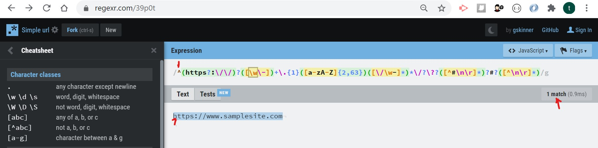

# Regular Expression for Matching on a URL

This gist provides a tutorial on the regular expression, or `regex`, pattern that can be used to match on a URL or web address. Included are descriptions of how each regular expression component works per the sample regex pattern. As regex is often used in conjunction with a script for validation or other purposes, this gist also includes an example on how to use the regex pattern with a RegExp exec() JavaScript method.

## Summary

* This regular expression, or regex, pattern can be used to match a URL type.  Here is the regex pattern we'll review in this tutorial:

`/^(https?:\/\/)?([\da-z\.-]+)\.([a-z\.]{2,6})([\/\w \.-]*)*\/?$/`

* The URLs that we'll reference and match in the example and TOC descriptions below are either one of these: `https://regexr.com/` or `https://site.com/`

* Why use a regex pattern?  The regex pattern for matching a URL can be used to validate a basic or customized web address or an URL pattern for any number of reasons. For example, the regex may test the URL contains a protocol with secured socket layer, such as `https` rather than `http`. The pattern above accepts both http and https, but not ftp for example. The regex pattern may be used to validate the URL contains a domain name such as `site.com`, and possibly a directory `\directory` and filename `\index.html`. The regex pattern can also match for specific characters between those pieces, such as the colon `:` after the protocol, to result in `https:` followed by double forward slashes to result in, `https://`, and so on, making regex patterning very useful in scripting validation for exact character and symbol matching.

* In this tutorial we'll use a sample that combines a regex pattern in conjunction with a JavaScript RegExp exec() method to validate that the URL matches the required regex pattern.

* JavaScript RegExp exec() sample:

```
var regexMatchingURL = /^(https?:\/\/)?([\da-z\.-]+)\.([a-z\.]{2,6})([\/\w \.-]*)*\/?$/;
var sampleString = 'https://regexr.com/';
var array;

while ((array = regexMatchingURL.exec(sampleString)) !== null) {
    if (array.index === regexMatchingURL.lastIndex) {
        regexMatchingURL.lastIndex++;
    }
    console.log(array);
}   
```

* When running the JavaScript code, the output from the RegExp exec() will produce an array index. If the web address value listed under the `var sampleString` is incorrect, the array will not show up within the console log output. For example, if the web address includes an ftp rather than https, or has listed three forward slashes, then the output will not produce an array. Here is the expected output, 

```
[
    'https://regexr.com/',
    'https://',
    'regexr',
    'com',
    '/',
    index: 0,
    input: 'https://regexr.com/',
    groups: undefined
]
```

* For more info on this output of the RegExp exec() method, you may find it here:
[https://developer.mozilla.org/en-US/docs/Web/JavaScript/Reference/Global_Objects/RegExp/exec](https://developer.mozilla.org/en-US/docs/Web/JavaScript/Reference/Global_Objects/RegExp/exec)

* To breakdown how the regex pattern works, below are a table of contents to describe each of the regex components used in the referenced pattern sample.


## Table of Contents

- [Anchors](#anchors)
- [Quantifiers](#quantifiers)
- [OR Operator](#or-operator)
- [Character Classes](#character-classes)
- [Flags](#flags)
- [Grouping and Capturing](#grouping-and-capturing)
- [Bracket Expressions](#bracket-expressions)
- [Greedy and Lazy Match](#greedy-and-lazy-match)

## Regex Components

### Anchors

* Anchor symbols
`^` or `$`

* Anchors are represented most often in the symbol `^`, or in combination with a trailing `$`. 
* The `^` anchor will indicate the first character of the regex string pattern. 
* The combination of the `^` at the beginning of the string pattern and `$` at the end indicates the `$` is the end of the string.

* Regex sample
`^(https?:\/\/)?([\da-z\.-]+)\.([a-z\.]{2,6})([\/\w \.-]*)*\/?$`

* In this example, the `^` anchor indicates the **h** preceding the https is the beginning of the pattern string. If the `h` in https were missing, such as ttp, the regex would not function, and the exec() example above would not run properly.

* In this example, the `$` anchor is the end of the string and line, so any additional trailing white spaces or other characters are ignored.

* A useful tool you may use to test your regex pattern, to demonstrate if the regex pattern matches your expected string results or not, is located here: [https://regexr.com/39p0t](https://regexr.com/39p0t) Within the regexr.com site you can enter the regex under Expression and the web address under Text.

 

### Quantifiers

* Quantifier symbols
`*` or `+` `?` or `{}`

* The `*` allows for any character afterward the preceeding character. So for `xyz*` this will work xyzp or xyzq, but not xytz.
* The `?` refers to the preceding character, as optional. So if `/?` then http://site.com/ or http://site.com will work.
* The `{}` brackets include various options regarding the preceding character.

* Regex sample
`^(https?:\/\/)?([\da-z\.-]+)\.([a-z\.]{2,6})([\/\w \.-]*)*\/?$`

* In this regex sample, the first quantifier in the pattern `https?` indicates the preceding character to the question mark symbol `s` is optional, meaning the pattern will accept a URL with either http or https.

* For this quantifier pattern `{2,6}` within its grouping it references the previous dot character. In this case the 2 indicates the a-z string and dot grouping must have 2 or more characters after the dot. In this sample,
* Will match: `https://site.com` 
* Will not match: `https://site.c` 

* At the end of the string the `?` quantifier again markes the preceding character as optional. Seen in the pattern `/?` this indicates the forward slash at the end of the URL is optional. 

* Without the question mark in the regex pattern `/`, the exec() validation will not work. 
* Will match: https://site.com/
* Will not match: https://site.com

* With the `/?` question mark after the forward slash, both with and without the trailing forward slash URL will pattern match:
* Will match: https://site.com/
* Will match: https://site.com

* The `?` quantifier after the https:// grouping `^(https?:\/\/)?` indicates the protocol, colon, and forward slashes are also optional in the URL. If you require the http or https protocol, then the second question mark should be removed. Both of these conditions will match in the sample regex pattern,
* Will match: https://site.com/
* Will match: site.com

### OR Operator

* Or Operator symbols
`|` or `[]`

* The `|` operator allows for either or, as in `x|y` which is x or y.
* The `[]` brackets are for the same condition, as in `[xy]` which is x or y. 

* Regex sample
`^(https?:\/\/)?([\da-z\.-]+)\.([a-z\.]{2,6})([\/\w \.-]*)*\/?$`

* In this regex sample, the bracket symbols indicate any lowercase letters may be selected.
* Will match: https://site.com
* Will not match: https://SITE.com

### Character Classes

* Character class examples
`.` or `\d` or `\w` or `\s`

* The `\d` matches a digit
* The `\w` will match a word
* The `\s` matches a single space
* The `.` is a wildcard for any character, unless preceded by a backwards slash `\.`, then it's a required dot

* Regex sample
`^(https?:\/\/)?([\da-z\.-]+)\.([a-z\.]{2,6})([\/\w \.-]*)*\/?$`

* In this regex sample `\.` refers to a required dot
* Will match: https://site.com
* Will not match: https://sitecom

* In this regex sample `\d` allows the domain name to contain digits 
* Will match: https://site.com
* Will also match: https://si5te.com

### Grouping and Capturing

* Grouping Sybmols
`()`

* The parenthesis groups the regex into parts, so the logic may be considered within the parenthesis.

* Regex sample
`^(https?:\/\/)?([\da-z\.-]+)\.([a-z\.]{2,6})([\/\w \.-]*)*\/?$`

* In this regex sample, the `?` separates Group 1 `(https?:\/\/)` and Group 2 `([\da-z\.-]+)`. In this case the `?` quantifier will apply to Group 1, making the entire protocol grouping optional. For example,
* Will match: https://site.com
* Will not match: site.com

* If the URL testing were `https://site.com/sample1/sample2/index.html` the groupings would be as follows:
- Group 1: https://
- Group 2: site
- Group 3: com
- Group 4: /sample1/sample2/index.html

### Bracket Expressions

* Sybmols
`[]`

* The `[xyz]` will match any character string within the brackets, either x, y, or z. 
* The `[x-z]` behaves in the same manner, allowing for any of the z, y, y chars, as does x|y|z.

* Regex sample
`^(https?:\/\/)?([\da-z\.-]+)\.([a-z\.]{2,6})([\/\w \.-]*)*\/?$`

* In this regex sample, `[a-z\.]` in the third grouping allows for any lowercase alphabetic characters from a through z, appended by a dot.
* Will match: https://site.com
* Will not match: https://site.Com
* Will not match: https://sitecom

### Greedy and Lazy Match

* The `*`, `+`, or  `{}` operators can be classified as greedy or lazy matches.

* Regex sample
`^(https?:\/\/)?([\da-z\.-]+)\.([a-z\.]{2,6})([\/\w \.-]*)*\/?$`

* In this regex sample, in the second grouping `([\da-z\.-]+)` the `+` operator is greedy as it allows character matching from one to an infinite amount of times. 
* Will match: https://site.com
* Will also match: https://siteeeeeeeeeeeeeeeeeeeeeeeeeeeeee.com


## References
* For more info on regex syntax or for testing the regex patterns, here are several useful references: 
- Syntax definitions https://medium.com/factory-mind/regex-tutorial-a-simple-cheatsheet-by-examples-649dc1c3f285
- Testing regex pattern matching https://regex101.com/
- Another good site for testing regex pattern matching https://regexr.com/

## Author
- ktrnthsnr
- Sr. Applications Engineer
- Contact https://ktrnthsnr.github.io/ktportfolio
- Projects https://github.com/ktrnthsnr
